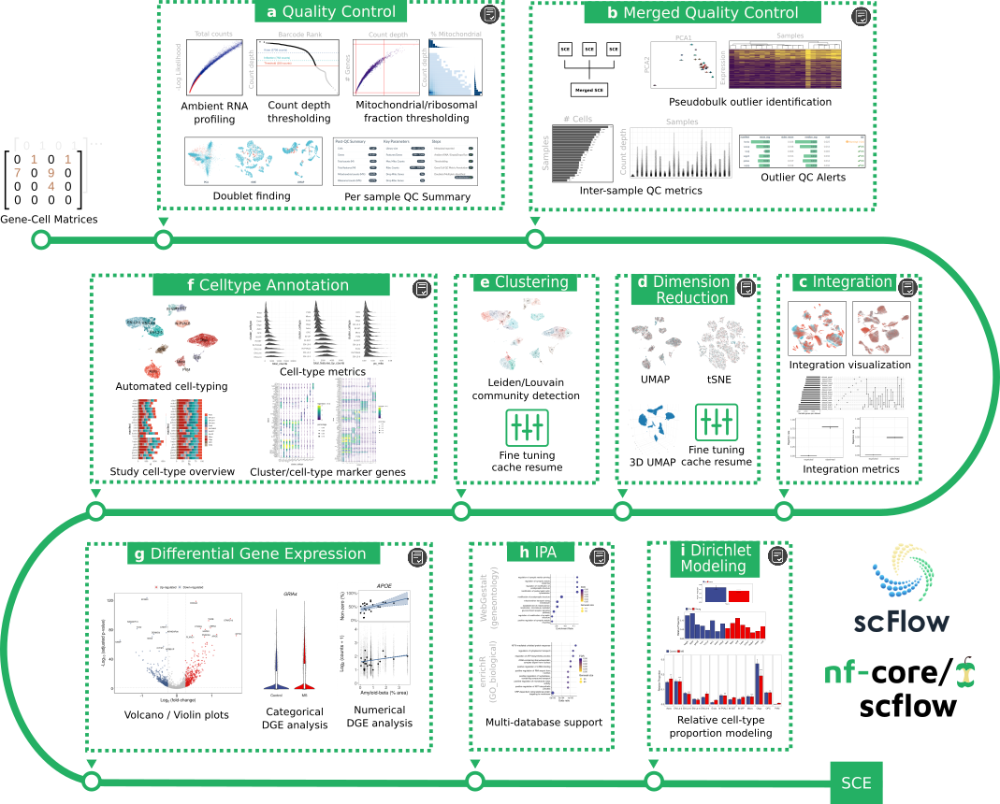

# 

[](https://github.com/nf-core/scflow/actions?query=workflow%3A%22nf-core+CI%22)
[](https://github.com/nf-core/scflow/actions?query=workflow%3A%22nf-core+linting%22)
[](https://nf-co.re/scflow/results)
[](https://doi.org/10.5281/zenodo.XXXXXXX)

[](https://www.nextflow.io/)
[](https://docs.conda.io/en/latest/)
[](https://www.docker.com/)
[](https://sylabs.io/docs/)

[](https://nfcore.slack.com/channels/scflow)
[](https://twitter.com/nf_core)
[](https://www.youtube.com/c/nf-core)

## Introduction

**nf-core/scflow** is a bioinformatics pipeline for scalable, reproducible, best-practice analyses of single-cell/nuclei RNA-sequencing data.

The pipeline is built using [Nextflow](https://www.nextflow.io), a workflow tool to run tasks across multiple compute infrastructures in a very portable manner.  Full case/control sc/sn-RNAseq analyses can be orchestrated with a single line of code on a local workstation, high-performance computing cluster (HPC), or on Cloud services including Google Cloud, Amazon Web Services, Microsoft Azure, and Kubernetes.  It uses Docker/Singularity containers making installation trivial and results highly reproducible.

Each new release of **nf-core/scflow** triggers automated continuous integration tests which run the pipeline on a full-sized dataset on the AWS cloud infrastructure. This ensures that the pipeline runs on AWS, has sensible resource allocation defaults set to run on real-world datasets, and permits the persistent storage of results to benchmark between pipeline releases and other analysis sources. The results obtained from the full-sized test can be viewed on the [nf-core website](https://nf-co.re/scflow/results).

## Pipeline summary

The **nf-core/scflow** pipeline takes post de-multiplexed sparse gene-cell counts matrices as input and performs a complete case/control analysis including the following steps: -



(a) Individual sample quality control including ambient RNA profiling, thresholding, and doublet/multiplet identification.
(b) Merged quality control including inter-sample quality metrics and sample outlier identification.
(c) Dataset integration with visualization and quantitative metrics of integration performance.
(d) Flexible dimensionality reduction with UMAP and/or tSNE.
(e) Clustering using Leiden/Louvain community detection.
(f) Automated cell-type annotation with rich cell-type metrics and marker gene characterization.
(g) Flexible differential gene expression for categorical and numerical dependent variables.
(h) Impacted pathway analysis with multiple methods and databases.
(i) Dirichlet modeling of cell-type composition changes.

Additionally, a high-quality, fully annotated, quality-controlled SingleCellExperiment (SCE) object is output for additional downstream tertiary analyses.  Simply read into R with the `read_sce()` function in the [scFlow](https://www.github.com/combiz/scFlow) R package.

Interactive HTML reports are generated for each analytical step indicated (grey icon).  See the manuscript for examples (see citations below).

Analyses are efficiently parallelized where possible (steps a,g,h, and i) and all steps benefit from NextFlow cache enabling parameter tuning with pipeline resume, i.e. you can stop the pipeline at any time, revise analytical parameters, and resume with the `-resume` parameter with only impacted/downstream steps restarted.  This is particularly useful for optimizing parameters for quality-control, clustering, dimensionality reduction, or to manually revise automated cell-type annotations.

For more details, see the pre-print: [scFlow: A Scalable and Reproducible Analysis Pipeline for Single-Cell RNA Sequencing Data](https://doi.org/10.22541/au.162912533.38489960/v1).

## Quick Start

### Analyse a test dataset

Try the pipeline on an in-built, minimal test dataset (all inputs will be automatically downloaded): -

1. Install [`Nextflow`](https://www.nextflow.io/docs/latest/getstarted.html#installation) (`>=21.04.0`)

2. Install any of [`Docker`](https://docs.docker.com/engine/installation/), [`Singularity`](https://www.sylabs.io/guides/3.0/user-guide/), [`Podman`](https://podman.io/), [`Shifter`](https://nersc.gitlab.io/development/shifter/how-to-use/) or [`Charliecloud`](https://hpc.github.io/charliecloud/) for full pipeline reproducibility.

3. Download the pipeline and test it on a minimal dataset with a single command:

    ```console
    nextflow run nf-core/scflow -profile test,<docker/singularity/podman/shifter/charliecloud/conda/institute>
    ```

    > - Please check [nf-core/configs](https://github.com/nf-core/configs#documentation) to see if a custom config file to run nf-core pipelines already exists for your Institute. If so, you can simply use `-profile <institute>` in your command. This will enable either `docker` or `singularity` and set the appropriate execution settings for your local compute environment.
    > - If you are using `singularity` then the pipeline will auto-detect this and attempt to download the Singularity images directly as opposed to performing a conversion from Docker images. If you are persistently observing issues downloading Singularity images directly due to timeout or network issues then please use the `--singularity_pull_docker_container` parameter to pull and convert the Docker image instead. Alternatively, it is highly recommended to use the [`nf-core download`](https://nf-co.re/tools/#downloading-pipelines-for-offline-use) command to pre-download all of the required containers before running the pipeline and to set the [`NXF_SINGULARITY_CACHEDIR` or `singularity.cacheDir`](https://www.nextflow.io/docs/latest/singularity.html?#singularity-docker-hub) Nextflow options to be able to store and re-use the images from a central location for future pipeline runs.
    > - If you are using `conda`, it is highly recommended to use the [`NXF_CONDA_CACHEDIR` or `conda.cacheDir`](https://www.nextflow.io/docs/latest/conda.html) settings to store the environments in a central location for future pipeline runs.

### Analyse your own data

The **nf-core/scflow** pipeline requires three inputs: (1) a two-column manifest file with paths to gene-cell matrices and a unique sample key; (2) a sample sheet with sample information for each input matrix in the manifest file; and, (3) a parameters configuration file ([see parameter documentation](https://nf-co.re/scflow/dev/parameters)).

A complete, automated, scalable, and reproducible case-control analysis can then be performed with a single line of code: -

1. Start running your own analysis!

    ```bash
    nextflow run nf-core/scflow \
    --manifest Manifest.tsv \
    --input Samplesheet.tsv \
    -c scflow_params.config \
    -profile local
    ```

Switching from a local workstation analysis to a Cloud based analysis can be achieved simply by changing the `profile` parameter. For example, a Google Cloud analysis with  automated staging of input matrices from Cloud storage (e.g. a Google Storage Bucket) can be achieved using `-profile gcp`.  Additionally, pre-configured institutional profiles for a range of university and research institution HPC systems are readily available via nf-core [configs](https://github.com/nf-core/configs).

## Documentation

The nf-core/scflow pipeline comes with documentation about the pipeline [usage](https://nf-co.re/scflow/usage), [parameters](https://nf-co.re/scflow/parameters) and [output](https://nf-co.re/scflow/output).

A general usage manual is available at [https://combiz.github.io/scflow-manual/](https://combiz.github.io/scflow-manual/). Code for the underlying scFlow R package toolkit is available on [GitHub](https://github.com/combiz/scflow) with associated function documentation at [https://combiz.github.io/scFlow](https://combiz.github.io/scFlow).  All code is open-source and available under the GNU General Public License v3.0 (GPL-3).

## Credits

nf-core/scflow was originally written by Dr Combiz Khozoie for use at the UK Dementia Research Institute and the Department of Brain Sciences at Imperial College London.

Dr Nurun Fancy and Dr Mahdi M. Marjaneh made valuable contributions to the impacted pathway analysis and integration (LIGER) modules, respectively.

Many thanks to other who have helped out along the way too, including (but not limited to): Paolo Di Tommaso, Philip A. Ewels, Harshil Patel, Alexander Peltzer, and Maxime Ulysse Garcia, and lab members including Johanna Jackson, Amy Smith, Karen Davey, and Stergios Tsartsalis.

## Contributions and Support

If you would like to contribute to this pipeline, please see the [contributing guidelines](.github/CONTRIBUTING.md).

For further information or help, don't hesitate to get in touch on the [Slack `#scflow` channel](https://nfcore.slack.com/channels/scflow) (you can join with [this invite](https://nf-co.re/join/slack)).

## Citations

If you use nf-core/scflow for your analysis, please cite it as follows:

> **scFlow: A Scalable and Reproducible Analysis Pipeline for Single-Cell RNA Sequencing Data.**
>
> Combiz Khozoie, Nurun Fancy, Mahdi M. Marjaneh, Alan E. Murphy, Paul M. Matthews, Nathan Skene
>
> _bioRxiv_ 2021 August 19. doi: [10.22541/au.162912533.38489960/v1](https://doi.org/10.22541/au.162912533.38489960/v1).

An extensive list of references for the tools used by the pipeline can be found in the [`CITATIONS.md`](CITATIONS.md) file and in the analysis reports.

You can cite the `nf-core` publication as follows:

> **The nf-core framework for community-curated bioinformatics pipelines.**
>
> Philip Ewels, Alexander Peltzer, Sven Fillinger, Harshil Patel, Johannes Alneberg, Andreas Wilm, Maxime Ulysse Garcia, Paolo Di Tommaso & Sven Nahnsen.
>
> _Nat Biotechnol._ 2020 Feb 13. doi: [10.1038/s41587-020-0439-x](https://dx.doi.org/10.1038/s41587-020-0439-x).
