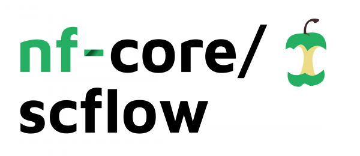

# 

**Complete analysis workflow for single-cell/nuclei RNA-sequencing data.**

[](https://github.com/nf-core/scflow/actions?query=workflow%3A%22nf-core+CI%22)
[](https://github.com/nf-core/scflow/actions?query=workflow%3A%22nf-core+linting%22)
[](https://nf-co.re/scflow/results)
[](https://doi.org/10.5281/zenodo.XXXXXXX)

[](https://www.nextflow.io/)
[](https://docs.conda.io/en/latest/)
[](https://www.docker.com/)
[](https://sylabs.io/docs/)

[](https://nfcore.slack.com/channels/scflow)
[](https://twitter.com/nf_core)
[](https://www.youtube.com/c/nf-core)

## Introduction

**nf-core/scflow** is a bioinformatics pipeline for the automated analysis of single-cell/nuclei RNA sequencing data.

The pipeline is built using [Nextflow](https://www.nextflow.io), a workflow tool to run tasks across multiple compute infrastructures in a very portable manner. It uses Docker/Singularity containers making installation trivial and results highly reproducible.

## Pipeline Summary

The nf-core/scflow pipeline automates the major analytical steps of a single-cell/nuclei analysis using the scFlow R package, which is built on top of popular single-cell/nuclei analysis packages within the R ecosystem (e.g. Seurat, Monocle, DoubletFinder, MAST, etc.)

The **nf-core/scflow** pipeline records and allows fine control over analytical [parameters](https://nf-co.re/scflow/dev/parameters), efficiently parallelizes and distributes compute load on diverse infrastructure (e.g. local, HPC, GCP, AWS, Azure, K8S), generates interactive reports for major analytical steps, and allows iterative parameter optimization using the NextFlow resume/cache functionality.

The major analytical steps include: -

1. Individual sample annotation and quality-control, including ambient RNA-profiling, thresholding, and doublet/multiplet identification. [Example Report]
2. Multi-sample merge and inter-sample quality control metrics. [Example Report]
3. Dimensionality reduction, clustering, and dataset integration. [Example Report]
4. Automated cell-typing, marker gene analysis, and cell-type metrics. [Example Report]
5. Differential gene expression, including mixed models. [Example Report]
6. Impacted Pathway Analysis. [Example Report]

In addition to interactive reports, the **nf-core/scflow** pipeline also exports publication quality tables and figures.  The final SingleCellExperiment object is also exported and can be easily loaded into R for tertiary analyses using the `scFlow::read_sce()` function.

## Quick Start

1. Install [`Nextflow`](https://nf-co.re/usage/installation) (`>=21.04.0`)

2. Install any of [`Docker`](https://docs.docker.com/engine/installation/), [`Singularity`](https://www.sylabs.io/guides/3.0/user-guide/), [`Podman`](https://podman.io/), [`Shifter`](https://nersc.gitlab.io/development/shifter/how-to-use/) or [`Charliecloud`](https://hpc.github.io/charliecloud/) for full pipeline reproducibility.

3. Download the pipeline and test it on a minimal dataset with a single command:

    ```bash
    nextflow run nf-core/scflow -profile test,<docker/singularity/podman/shifter/charliecloud/conda/institute>
    ```

    > * Please check [nf-core/configs](https://github.com/nf-core/configs#documentation) to see if a custom config file to run nf-core pipelines already exists for your Institute. If so, you can simply use `-profile <institute>` in your command. This will enable either `docker` or `singularity` and set the appropriate execution settings for your local compute environment.
    > * If you are using `singularity` then the pipeline will auto-detect this and attempt to download the Singularity images directly as opposed to performing a conversion from Docker images. If you are persistently observing issues downloading Singularity images directly due to timeout or network issues then please use the `--singularity_pull_docker_container` parameter to pull and convert the Docker image instead. Alternatively, it is highly recommended to use the [`nf-core download`](https://nf-co.re/tools/#downloading-pipelines-for-offline-use) command to pre-download all of the required containers before running the pipeline and to set the [`NXF_SINGULARITY_CACHEDIR` or `singularity.cacheDir`](https://www.nextflow.io/docs/latest/singularity.html?#singularity-docker-hub) Nextflow options to be able to store and re-use the images from a central location for future pipeline runs.
    > * If you are using `conda`, it is highly recommended to use the [`NXF_CONDA_CACHEDIR` or `conda.cacheDir`](https://www.nextflow.io/docs/latest/conda.html) settings to store the environments in a central location for future pipeline runs.

4. Start running your own analysis!

    ```bash
    nextflow run nf-core/scflow -profile <docker/singularity/podman/shifter/charliecloud/conda/institute> --input SampleSheet.tsv --manifest Manifest.tsv -c ./conf/scflow_analysis.config
    ```

## Documentation

The nf-core/scflow pipeline comes with documentation about the pipeline: [usage](https://nf-co.re/scflow/usage), [parameters](https://nf-co.re/scflow/parameters), and [output](https://nf-co.re/scflow/output).

A manual describing a typical usage of nf-core/scflow is [here](https://combiz.github.io/scflow-manual/).

The underlying R package GitHub repository is available [here](https://github.com/combiz/scflow) and the package function documentation can be found [here](https://combiz.github.io/scFlow/).

The bioRxiv manuscript is in preparation: (URL)

## Credits

The nf-core/scflow pipeline and the NextFlow DSL2 update was written by Combiz Khozoie from [The Department of Brain Sciences, Imperial College London](https://www.imperial.ac.uk/brain-sciences).

The underlying scFlow R package was written by Combiz Khozoie (drcombiz), Nurun Fancy (@FancyNurun), Mahdi Moradi Marjaneh, Alan Murphy (@Al_Murphy_), and Nathan Skene (@n_skene).

Many thanks to others who have helped out along the way, including (but not limited to): @pditommaso, @drpatelh, @ewels, @apeltzer.

## Contributions and Support

If you would like to contribute to this pipeline, please see the [contributing guidelines](.github/CONTRIBUTING.md).

For further information or help, don't hesitate to get in touch on the [Slack `#scflow` channel](https://nfcore.slack.com/channels/scflow) (you can join with [this invite](https://nf-co.re/join/slack)).

## Citations

If you use nf-core/scflow for your analysis, please cite it using the following DOI: [10.22541/au.162912533.38489960/v1](https://doi.org/10.22541/au.162912533.38489960/v1).

An extensive list of references for the tools used by the pipeline can be found in the [`CITATIONS.md`](CITATIONS.md) file.

You can cite the `nf-core` publication as follows:

> **The nf-core framework for community-curated bioinformatics pipelines.**
>
> Philip Ewels, Alexander Peltzer, Sven Fillinger, Harshil Patel, Johannes Alneberg, Andreas Wilm, Maxime Ulysse Garcia, Paolo Di Tommaso & Sven Nahnsen.
>
> _Nat Biotechnol._ 2020 Feb 13. doi: [10.1038/s41587-020-0439-x](https://dx.doi.org/10.1038/s41587-020-0439-x).
